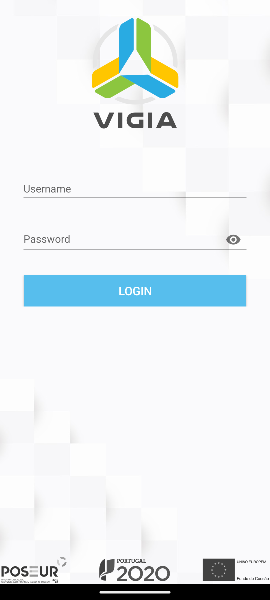
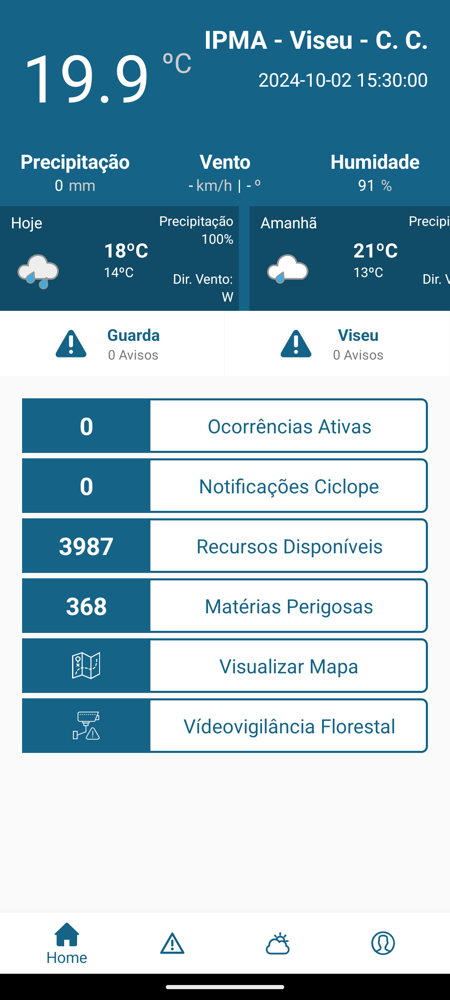
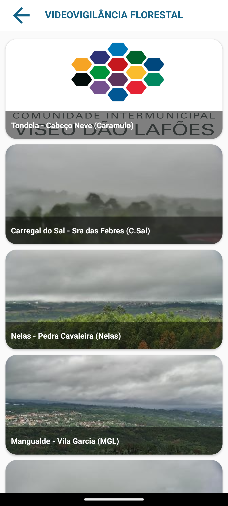

# SADGE e VIGIA

A Plataforma de Emergência e Proteção Civil Intermunicipal, direcionada para as equipas de proteção civil e forças de segurança, fornece apoio às operações em momentos de resposta a fenómenos de emergência. A plataforma permite monitorizar e gerir ocorrências de proteção civil em tempo real, incluindo ferramentas de análise preditiva de impacto dos acidentes e capacidades de simulação de cenários de risco, como incêndios, fenómenos naturais e sinistros variados.

<table>
  <tr>
    <td>
      
    </td>
    <td>
      
    </td>
    <td>
      
    </td>
  </tr>
   <tr>
    <td>
      
    </td>
    <td>
      
    </td>
    <td>
      
    </td>
  </tr>
  <tr>
    <td>
      
    </td>
    <td>
      
    </td>
    <td>
      
    </td>
  </tr>
  <td>
      
    </td>
    <td>
      
    </td>
    <td>
      
    </td>
  </tr>
</table>

## Funcionalidades

- Monitorização e gestão de ocorrências em tempo real
- Análise preditiva de impacto e simulação de cenários de risco
- Integração de dados meteorológicos em tempo real
- Acesso à base de dados espaciais do Portal Geográfico Intermunicipal

## Tecnologias Utilizadas

### Web

- **Framework:** Codeigniter 4 com componentes VUE
- **Base de Dados:** PostgreSQL

### Mobile

- **Linguagem:** Kotlin com arquitetura MVVM
- **Layout:** XML
- **Base de Dados:** SQLite (Room database)
- **Ferramentas:** Injeção de dependências (dagger/hilt), cliente HTTP (retrofit)

## Contribuições

Este projeto foi desenvolvido com a colaboração de várias equipas especializadas e baseia-se em estudos especializados, incluindo o Impacto das Alterações Climáticas, Cartas de Risco Municipais, e análise de Grandes Incêndios da Região.

## Licença

Este projeto não contém código fonte devido a restrições de propriedade intelectual da empresa anterior.
